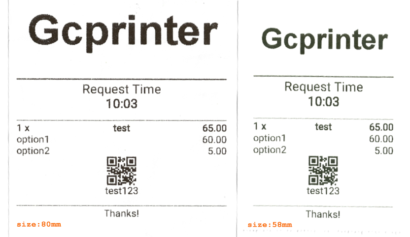

This demo demonstrates how to use the react-native-ebprinter SDK to print receipts. The react-native-ebprinter SDK supports Goodcom POS machines, Bluetooth printers, USB printers, and Wi-Fi printers.
<p float="left">
  
  
</p>
This is a [**React Native**](https://reactnative.dev) project, bootstrapped using [`@react-native-community/cli`](https://github.com/react-native-community/cli).

# Getting Started

>**Note**: Make sure you have completed the [React Native - Environment Setup](https://reactnative.dev/docs/environment-setup) instructions till "Creating a new application" step, before proceeding.

## Step 1: Installation

```bash
npm install react-native-ebprinter --save
```

or

```bash
yarn add react-native-ebprinter
```

## Step 2: Add dependenceie

* modify  app/build.gradle under the android project：

```javascript
implementation project(':react-native-ebprinter')
```

## Step 3: Add 'EbPrinterPackage' to MainApplication

```java
import com.goodcom.react.EbPrinter.EbPrinterPackage;
...

        @Override
        protected List<ReactPackage> getPackages() {
            return Arrays.<ReactPackage>asList(
                    new MainReactPackage(),
                    new EbPrinterPackage()
            );
```

## Step 4: Import in React-Native

```javascript
import EbPrinter, {FontSize, AlignmentType, BarcodeType} from 'react-native-ebprinter';
```

## API

### Constants
FontSize : font size
AlignmentType : Alignment Type
BarcodeType : Barcode Type
| Type           | Sub type                                                    | 
|:-----:|:-----------:|
|FontSize        |Default,Small,Medium,Big,DoubleHeight,DoubleWidth,SmallBold,MediumBold,BigBold,DoubleHeightBold,DoubleWidthBold  |
|AlignmentType   |Left,Center,Right                                            |
|BarcodeType     |barcodeUpca,barcodeUpce,barcodeEan8,barcodeEan13,barcodeCode128,barcodeCode39,barcodeCodeBar,barcodeItf,barcodeCode93,barcodeQrCode  |
### Method 
The `deviceIndex` parameter represents the device number, which defaults to -1. When multiple printing devices need to be used simultaneously, this parameter can be specified, such as 0, 1, 2, 3, etc.
| Method                 | Parameter                                                            | Return Type       |
|:-----:|:-----------:|:-----------:|
| drawText               |deviceIndex,strLeft, fontLeft, strMid, fontMid, strRight, fontRight   | void              |
| printText              |deviceIndex,isAutoFeed                                                | void              |
| drawLeftRight          |deviceIndex,strLeft, fontLeft, strRight, fontRight                    | void              |
| drawCustom             |deviceIndex,string, fontSize, align                                   | void              |
| drawNewLine            |deviceIndex                                                           | void              |
| drawOneLine            |deviceIndex,fontSize                                                  | void              |
| drawOneLineDefault     |deviceIndex                                                           | void              |
| drawBarcode            |deviceIndex,str, align, type                                          | void              |
| drawBarcodeWithHeight  |deviceIndex,string, align, type, height                               | void              |
| drawQrCode             |deviceIndex,string, align                                             | void              |
| drawQrCodeWithHeight   |deviceIndex,string,align,height                                       | void              |
| isDeviceSupport        |deviceIndex                                                           | `Promise<number>` |
| printJson              |deviceIndex,json                                                      | void              |
| printImageByBase64     |deviceIndex,base64, align, isAutoFeed                                 | void              |
| printImageByArray      |deviceIndex,byteArray, align, isAutoFeed                              | void              |
| openCashBox            |deviceIndex                                                           | void              |
| showLcdBitmapByBase64  |deviceIndex,base64                                                    | void              |
| showLcdBitmapByArray   |deviceIndex,byteArray                                                 | void              |
| selectBluetoothPrinter |deviceIndex,macAddress                                                | void              |
| selectUsbPrinter       |deviceIndex,deviceInfo                                                | void              |
| selectUsbPrinterById   |deviceIndex,vid, pid                                                  | void              |
| selectNetworkPrinter   |deviceIndex,ipAddress, port                                           |`Promise<boolean>` |
| getBluetoothDeviceList |deviceIndex                                                           |`Promise<string[]>`|
| getUsbDeviceList       |deviceIndex                                                           |`Promise<string[]>`|

```javascript

  /**
   * Draw text into memory, you can specify the position and font size of the printed text, and you can print the left, middle, and right text at the same line
   * You can continuously use drawText to draw all the contents into memory, and finally use printText to print the contents.
   */
  drawText: (deviceIndex, strLeft, fontLeft, strMid, fontMid, strRight, fontRight) => void,
 /**
   * Start printing. Except for image printing, other APIs, such as drawText, just draw the printing content in the memory first, and the printing has not been started yet.
   * This method is to print out the printing content in the memory.Control whether to automatically feed paper through isAutoFeed
   */
  printText: (deviceIndex,isAutoFeed) => void,
  /**
   * Draw text into memory, you can print left-aligned and right-aligned content at the same line. It needs to be printed using printText.
   */
  drawLeftRight: (deviceIndex, strLeft, fontLeft, strRight, fontRight) => void,
  /**
   * Draw text content to memory, you can specify the size and position of the content. It needs to be printed using printText.
   */
  drawCustom: (deviceIndex, string, fontSize, align) => void,
  /**
   * Draw a blank line, similar to a newline.
   */
  drawNewLine: (deviceIndex) => void,
  /**
   * Draw a horizontal line, you can specify the thickness of the horizontal line by setting the font size.
   */
  drawOneLine: (deviceIndex,fontSize) => void,
  /**
   * Draw a horizontal line, use the default font without specifying the font size
   */
  drawOneLineDefault: (deviceIndex) => void,
  /**
   * Draw barcodes, including qrcode, you can specify the alignment position and barcode type of the barcode.
   */
  drawBarcode: (deviceIndex,str, align, type) => void,
  /**
   * Draw barcodes, including qrcode, you can specify the alignment position and barcode type of the barcode.
   * The height of the barcode can be specified. No width parameter is required, the width is determined by the specific barcode
   */
  drawBarcodeWithHeight: (deviceIndex,string, align, type, height) => void,
   /**
   * Draw qrcode,you can specify the alignment position of the qrcode.
   */
  drawQrCode: (deviceIndex,string, align) => void;
  /**
   * Draw qrcode,you can specify the alignment position of the qrcode.
   * The height of the qrcode can be specified. No width parameter is required, the width is determined by the specific qrcode
   */
  drawQrCodeWithHeight: (deviceIndex,string,align,height) => void;  
  /**
   * Check whether printing is supported. This method returns true only on goodcom printers. This method allows the app to distinguish printers from different manufacturers.
   */
  isDeviceSupport: (deviceIndex) => Promise<string>,
  /**
   * Print the content in json format, which will be parsed by the printer according to the template and formatted for printing
   */
  printJson: (deviceIndex,json) => void,
  /**
   * Printing an image using base64 encoding, the Base64 string must start with "data:image/png;base64,"
   * You can set the alignment position of the printed image, and decide whether to automatically feed the paper after printing.
   * If you want to print the text after printing the image, the paper will not be automatically fed.
   */
  printImageByBase64: (deviceIndex,base64, align, isAutoFeed) => void,
  /**
  * Printing an image using byteArray
  * You can set the alignment position of the printed image, and decide whether to automatically feed the paper after printing.
  * If you want to print the text after printing the image, the paper will not be automatically fed.
  */
  printImageByArray: (deviceIndex,byteArray, align, isAutoFeed) => void,
  /**
  * Used to open the cash box, it will be opened once when called. Currently, only GT11R is supported
  */
  openCashBox: (deviceIndex) => void,
  /**
  * Show bitmap in customer display LCD by base64 encoding
  * The maximum size is 240 * 320,Images smaller than the customer display screen will be displayed in the center.
  * This feature is supported on some models.
  */
  showLcdBitmapByBase64: (deviceIndex,base64) => void,
  /**
  * Show bitmap in customer display LCD by byteArray
  * The maximum size is 240 * 320,Images smaller than the customer display screen will be displayed in the center.
  * This feature is supported on some models.
  */
  showLcdBitmapByArray: (deviceIndex,byteArray) => void,
  /**
  * Select Bluetooth printing and set the bluetooth address of the Bluetooth printer device. 
  * This method is not mandatory. 
  * When no Bluetooth device address is set, the SDK will automatically display a list of devices for the user to select.
  */
  selectBluetoothPrinter: (deviceIndex,macAddress) => void,
  /**
  * Select USB printing and specify the USB printing device
  * The deviceInfo format: vendor_id: xxx product_id: yyy Where xxx represents the vendor ID and yyy represents the product ID
  */
  selectUsbPrinter: (deviceIndex,deviceInfo) => void,
  /**
  * Select USB printing and specify the USB printing device
  */
  selectUsbPrinterById: (deviceIndex,vid ,pid) => void,
  /**
  * Select network printing and specify the IP address of the device.
  */
  selectNetworkPrinter: (deviceIndex,ipAddress, port) => void,
  /**
  * Get Bluetooth devices
  */
  getBluetoothDeviceList: (deviceIndex) => Promise<string[]>,
  /**
  * Get USB devices.
  */
  getUsbDeviceList: (deviceIndex)=>  Promise<string[]>,
```